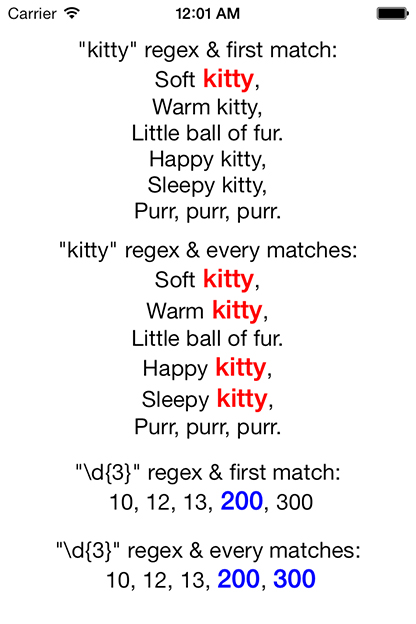

# TTTRegexAttributedLabel
## Add addition functions (regex) to TTTAttributedLabel.

`TTTRegexAttributedLabel` allows to set Font & Color to TTTAttributedLabel via Regex easier.



## Example Usage

``` objective-c
    //SET FONT ONLY ON FIRST MATCH REGEX
    TTTRegexAttributedLabel *label1 = [[TTTRegexAttributedLabel alloc] initWithFrame:CGRectMake(25, 20, self.view.bounds.size.width - 50, 160)];
    label1.numberOfLines = 0;
    label1.textAlignment = NSTextAlignmentCenter;
    NSString *s1 = @"Soft kitty,\nWarm kitty,\nLittle ball of fur.\nHappy kitty,\nSleepy kitty,\nPurr, purr, purr.";
    [label1 setText:s1 withFirstMatchRegex:@"kitty"
         withFont:[UIFont boldSystemFontOfSize:20]
        withColor:[UIColor redColor]];
  
    //SET FONT & COLOR EVERY MATCHES
    TTTRegexAttributedLabel *label2 = [[TTTRegexAttributedLabel alloc] initWithFrame:CGRectMake(25, 180, self.view.bounds.size.width - 50, 160)];
    label2.numberOfLines = 0;
    label2.textAlignment = NSTextAlignmentCenter;
    NSString *s2 = @"Soft kitty,\nWarm kitty,\nLittle ball of fur.\nHappy kitty,\nSleepy kitty,\nPurr, purr, purr.";
    [label2 setText:s2 withRegex:@"kitty"
         withFont:[UIFont boldSystemFontOfSize:20]
        withColor:[UIColor redColor]];
  
    ///SET FONT ONLY ON FIRST MATCH REGEX
    TTTRegexAttributedLabel *label3 = [[TTTRegexAttributedLabel alloc] initWithFrame:CGRectMake(25, 350, self.view.bounds.size.width - 50, 50)];
    label3.numberOfLines = 0;
    label3.textAlignment = NSTextAlignmentCenter;
    NSString *s3 = @"10, 12, 13, 200, 300";
    [label3 setText:s3 withFirstMatchRegex:@"(\\d{3})"
         withFont:[UIFont boldSystemFontOfSize:20]
        withColor:[UIColor blueColor]];
  
    //SET FONT & COLOR EVERY MATCHES
    TTTRegexAttributedLabel *label4 = [[TTTRegexAttributedLabel alloc] initWithFrame:CGRectMake(25, 410, self.view.bounds.size.width - 50, 50)];
    label4.numberOfLines = 0;
    label4.textAlignment = NSTextAlignmentCenter;
    NSString *s4 = @"10, 12, 13, 200, 300";
    [label4 setText:s4 withRegex:@"(\\d{3})"
         withFont:[UIFont boldSystemFontOfSize:20]
        withColor:[UIColor blueColor]];
```

## Functions available

``` objective-c
- (void) setText:(id)text withFirstMatchRegex:(NSString*)regex withRegexOptions:(NSRegularExpressionOptions)regexOption withFont:(UIFont*)font withColor:(UIColor*)color;
- (void) setText:(id)text withFirstMatchRegex:(NSString*)regex withFont:(UIFont*)font withColor:(UIColor*)color;
- (void) setText:(id)text withFirstMatchRegex:(NSString*)regex withFont:(UIFont*)font;

- (void) setText:(id)text withRegex:(NSString*)regex withRegexOptions:(NSRegularExpressionOptions)regexOption withFont:(UIFont*)font withColor:(UIColor*)color;
- (void) setText:(id)text withRegex:(NSString*)regex withFont:(UIFont*)font withColor:(UIColor*)color;
- (void) setText:(id)text withRegex:(NSString*)regex withFont:(UIFont*)font;
```

## Credits

Inspired by [Mattt Thompson](https://github.com/mattt)'s [TTTAttributedLabel](https://github.com/mattt/TTTAttributedLabel), 

## Contact

Quentin Rousseau

- https://github.com/kwent
- http://twitter.com/quentinrousseau
- contact@quentinrousseau.fr

## License

TTTRegexAttributedLabel is available under the MIT license. See the LICENSE file for more info.
